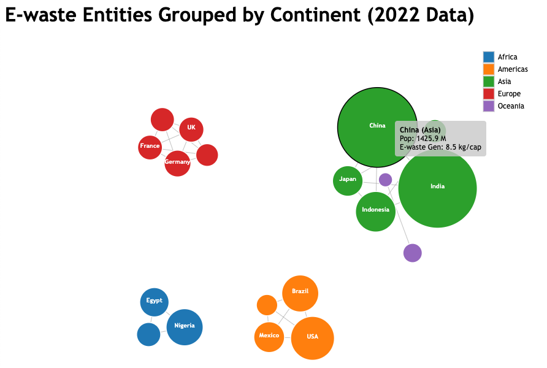
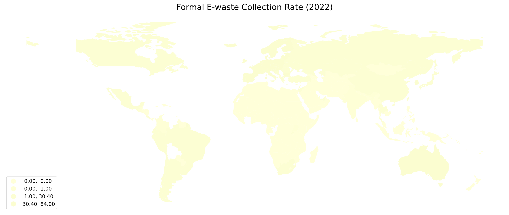
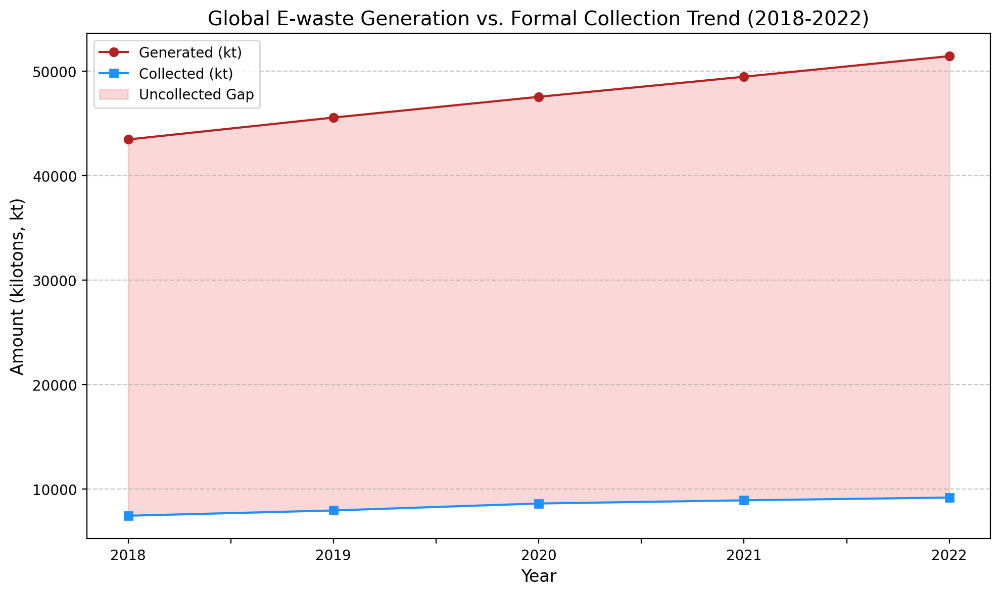

# 🌎 Global E-waste Analytics & Visualization (2018-2022)

<!-- Language Switcher -->

---

> This project analyzes global e-waste generation and recycling trends, exploring the role of data visualization in communicating complex environmental issues. Data was sourced from public reports and collected via an automated script. All analysis and visualization were completed as part of the CSE6242 course at Georgia Tech.

---

## 🚀 Interactive Data Exploration (with D3.js)

To intuitively represent the position of major economies in the global e-waste landscape, I developed an interactive network graph using D3.js. Hover over the nodes to explore the corresponding data.

#### **[➡️ Click here for the Interactive Visualization Demo](https://AdorableLake.github.io/Global-Ewaste-Analytics/Node.html)**

  

---

## 📊 Key Findings & Visualizations

Spatio-temporal analysis of the 2018-2022 dataset reveals the following key trends:

#### 1. Stark Geospatial Disparities in Collection Rates (2022)
Europe maintains a high average collection rate (~43%), whereas formal collection systems in most parts of Asia and Africa are significantly less developed, with rates often below 10%.

  

#### 2. Widening "Uncollected Gap" (2018-2022)
The data indicates that global e-waste generation is growing faster than the capacity of formal collection systems. This widening gap represents both a significant loss of valuable resources and a growing environmental risk.

  

---

## 🛠️ Project Workflow

This project covers an end-to-end data science pipeline:
1.  **Data Collection**: An automated script using Python (`Requests`, `BeautifulSoup`) was developed to scrape data from the Global E-waste Statistics Partnership website.
2.  **Data Processing**: The raw data was cleaned, structured, and merged with geospatial information using `Pandas` and `GeoPandas`.
3.  **Data Visualization**:
    *   **Static Visuals**: Trend charts and choropleth maps were generated with `Matplotlib`.
    *   **Interactive Visuals**: A network graph was built using `D3.js`.
4.  **Reporting**: Findings were summarized in a final report and a poster.

---

## 📂 Repository Contents
- `Node.html`: The interactive D3.js visualization file.
- `src/`: Contains the Python source code for data collection.
- `reports/`: Includes the detailed `Final_Report.pdf` and summary `Poster.pdf`.
- `assets/`: Contains all static visualizations.

---
